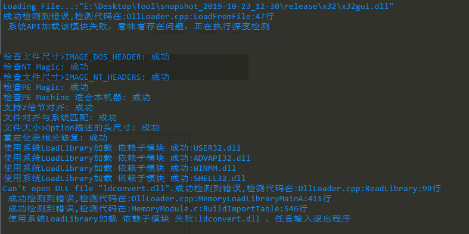
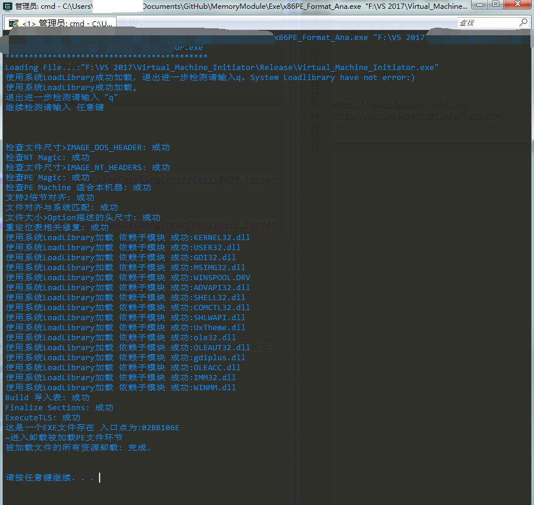

Check EXE Why Error
============


当你遇到一个损坏的exe或者dll的时候,你希望搞清楚那些错误弹窗的根本原因.

你需要更多信息.

可能是PE格式被破坏,也可能是缺失DLL。只要你使用本程序就能解决问题了。

损坏的PE文件检查效果如下:
你可以看到它检查出了: 之所以加载程序失败是因为: `cximageecrt.dll`这个文件缺失.



正确的PE文件如下:



[x86PE_Format_Ana.exe](https://github.com/dalerkd/PE_Format_Checker/raw/future/RecursiveCheckingError/Exe/x86PE_Format_Ana.zip)

[x86PE_Format_Ana.exe](https://github.com/dalerkd/PE_Format_Checker/raw/future/RecursiveCheckingError/Exe/x64PE_Format_Ana.zip)


## 其他


1. 附带本程序会报错给你并告诉你关键信息。它发生在哪里。以及周围的值。比如第几个结构的格式出错和它的偏移。
2. 并会根据你附带的源码来提供更多信息:最好就符号文件+源码.
3. 异常的处理,友好一些.

为了实现以上目的,我需要完成如下工作:

1. 日志库的使用,以及更友好的日志输出.例如:不同颜色.
2. 符号文件分析或者其他更友好的方法
3. 大量的标注和信息获取.
4. 异常截获,让本程序能正常使用.

下一步工作:
## 增加对所有依赖库的格式解析与加载
目前是调用系统的LoadLibrary("")
为了进一步检查依赖的DLL是否有问题，所以需要全面检查依赖DLL。

主要有两步工作：
1. 加载库路径的顺序的配置:提供两套
2. 已经加载文件的列表:是否需要加载取决于是否已经存在.
列表有默认值是本分析程序依赖的dll:
```
{
	ntdll.dll,
	kernel32.dll,
	KernelBase.dll,
	user32.dll,
	gdi32.dll,
	lpk.dll,
	usp10.dll,
	msvcrt.dll,
	advapi32.dll,
	sechost.dll,
	rpcrt4.dll,
	sspicli.dll,
	cryptbase.dll,
	imm32.dll,
	msctf.dll,
	api-ms-win-core-synch-l1-2-0.dll

}
```


### 我们工作的内容主要涉及:
- main文件在 ./example/DllLoader.cpp
- 检测代码在:./MemoryModule.c


----------------------

The default windows API functions to load external libraries into a program
(`LoadLibrary`, `LoadLibraryEx`) only work with files on the filesystem.  It's
therefore impossible to load a DLL from memory.

But sometimes, you need exactly this functionality (e.g. you don't want to
distribute a lot of files or want to make disassembling harder).  Common
workarounds for this problems are to write the DLL into a temporary file
first and import it from there.  When the program terminates, the temporary
file gets deleted.

`MemoryModule` is a library that can be used to load a DLL completely from
memory - without storing on the disk first.

See `doc/readme.rst` for more informations about the format of a DLL file and
a tutorial how they can be loaded directly.
